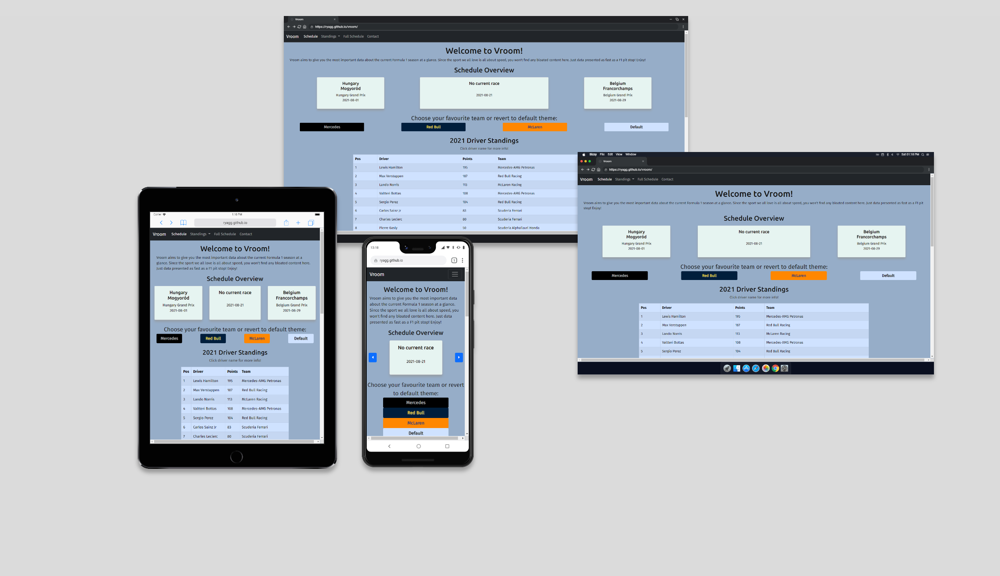

# **Vroom**

## **About**

Link to live project: [Vroom](https://ryagg.github.io/vroom)

Vroom is a website that provides a quick overview of the most important F1 Data using the API-FORMULA-1 by API-SPORTS. Users can see the current, previous, and upcoming race at a glance, take a look at the driver’s and team standings, see the full race calendar with track details and change the website’s theme.

Due to most of the data on the site being dependent on API calls I couldn't use the usual tools (http://ami.responsivedesign.is/ or https://techsini.com/multi-mockup/). The table with the driver standings would have been empty and the three cards for the schedule overview would have showed placeholder text. I therefore used Sizzy to create the mockup.

## **User Experience (UX)**

---

### **User stories:**

**Generic user (website visitor):**

-   As a user, I want to quickly see the time and date of the current and/or next race so that I don’t miss events.
-   As a user, I want to see the driver’s and teams’ standings so that I’m up to date on results.
-   As a user, I want to see the latest results of drivers and teams so that I can gauge their form.
-   As a user, I want to see the whole race calendar with track details so that I can decide if I want to buy tickets for the race.
-   As a user, I want to be able to change the website’s theme so that I can adjust it to my liking.

**Website owner:**

-   As the website owner, I want the site to be responsive, so that users can enjoy it on all devices from mobile phones to desktops.
-   As the website owner, I want the site to be as informative as possible without being cluttered, so that users can find the information they’re looking for quickly.

## **Design**

---

The project uses the Bootstrap framework to ensure a responsive design. Where possible, design elements with either an association with speed or Formula One were chosen.

### **Colour Scheme**

For the themes I used the team colours from Red Bull Racing, Mercedes and McLaren Mercedes. For the default theme I chose colours with a high contrast to ensure readability and accessibility. I used [Coolors](https://coolors.co) to generate my colour palette.

**ADD COLOUR PALETTE**

### **Typography**

For fonts, I used Ubuntu as primary font. Especially the letters f, t and n transport a sense of speed. As secondary font, I chose Fira Sans.

### **Icons**

All implemented icons are from [Font Awesome](https://fontawesome.com).

### **Imagery**

**Placeholder**

### **Wireframes**

I used Balsamiq to plan the site’s layout for different viewports (mobile, tablet and desktop). To better demonstrate the differences, I sort my wireframes by page and show the versions for mobile, tablet and desktop next to each other.

[Wireframes for index.html](wireframes/index.png)

Differences in the deployed version:
**Add description**

[Wireframes for contact.html](wireframes/contact.png)

Differences in the deployed version:

-   The elements with information about each race in the 2021 season have been moved to a separate page. The layout hasn't changed, therefore I didn't create a new wireframe.
-   The display of the first three places from the previous year for each race has been removed from the project. It would have added at least 22 more API calls. Furthermore, neither one of the two APIs I'm using provides suitable endpoints.

## **Features**

---

### **Existing Features**

**Add list**

### **Features to be implemented**

**Add list**

## **Technologies Used**

### **Languages**

-   [HTML5](https://developer.mozilla.org/en-US/docs/Web/Guide/HTML/HTML5)
-   [CSS3](https://developer.mozilla.org/en-US/docs/Web/CSS)
-   [JavaScript](https://developer.mozilla.org/en-US/docs/Web/JavaScript)

### **Libraries & Frameworks**

-   [Bootstrap 5.0.1](https://getbootstrap.com/docs/5.0/getting-started/introduction/)
-   [jQuery 3.6.0](https://jquery.com/)
-   [Day.js 1.10.6](https://day.js.org/en/)
-   [Google Fonts](https://fonts.google.com/)
-   [Font Awesome](https://fontawesome.com/)

### **Tools**

-   [VSCode](https://code.visualstudio.com/)
-   [Git BASH](https://gitforwindows.org/)
-   [GitHub](https://github.com/)
-   [Google Chrome Developer Tools](https://developer.chrome.com/docs/devtools/)
-   [Sizzy](https://sizzy.co/)
-   [Balsamiq](https://balsamiq.com/)
-   [Coolors colour palette generator](https://coolors.co/)
-   [mycolor.space](https://mycolor.space/)
-   [Google Cloud Platform](https://cloud.google.com/)
-   [W3C HTML Validation Service](https://validator.w3.org/)
-   [W3C CSS Validation Service](https://jigsaw.w3.org/css-validator/)
-   [GitHub Wiki TOC generator](https://ecotrust-canada.github.io/markdown-toc/)

## **Testing**

---

### **Functionality Testing**

**to be added**

## **Usability Testing**

**to be added**

## **Compatibility Testing**

**to be added**

## **Testing User Stories**

**to be added**

## **Bugs**

-   Missing track maps for the Portugese, Saudi Arabia and Abhu Dhabi Grand Prix
    The function addTrackMap(className, query) returns an object with various data about the race track. The variable trackMap contains the URL for the track map. There are URLs for each of the race tracks. But the URLS for the races in Saudi Arabia and Abu Dhabi lead to a '404 Not Found' page. This then causes an uncaught TypeError in the console. Depending on whether I declare the variable trackName or trackMap first the error will read 'Cannot read property 'name' of undefined at addTrackMap' or 'Cannot read property 'image' of undefined at addTrackMap'. This error is neither caused by me nor can it be fixed by me.
    The URL for the race in Portugal displays the race map but on the deployed site only the alt text is displayed. For the moment, I will continue with other features and chores and hopefully be able to find a fix for this before I submit the project.

## **Deployment**

---

-   GitHub Pages

    1. The project was deployed on GitHub Pages. The following steps were taken.
    2. In the repository, go the the project main page.
    3. Click on 'Settings' and then scroll down to the section 'GitHub Pages'.
    4. Click on the link for the new dedicated Page settings tab.
    5. In the new window using the drop-down menu select the main branch and then click on 'Save'.
    6. The site is now published and a link is provided.

-   Forking
    If you wish to use this repository as a starting point or to propose changes to this project, you can fork it. Follow the steps below.

    1. Navigate to the repository, e.g. [Ryagg/ms2-speedy-f1-data](https://github.com/Ryagg/ms2-speedy-f1-data)
    2. Click 'Fork' in the top-right corner.

-   Cloning
    Cloning a repository creates a local copy on your computer. Follow the steps below.
    1. Navigate to the repository, e.g. [Ryagg/ms2-speedy-f1-data](https://github.com/Ryagg/ms2-speedy-f1-data)
    2. Click 'Code' above the list of files.
    3. In the new window, cloning using HTTPS is the default option. Copy the provided link manually or by clicking on the clipboard symbol.
    4. Open Git Bash.
    5. Navigate to your desired directory for the cloned project.
    6. Type 'git clone' followed by the URL copied in step 3.
    7. Press **Enter** to create your local clone.

## **Credits**

**to be added**

### **Media**

The following photos used for this project were obtained from [Unsplash](https://unsplash.com).

#### schedule.html

Nürburgring: Photo by [Jan Ivo Henze](https://unsplash.com/@jan_ivo?utm_source=unsplash&utm_medium=referral&utm_content=creditCopyText) on [Unsplash](https://unsplash.com/s/photos/racetrack?utm_source=unsplash&utm_medium=referral&utm_content=creditCopyText)

#### 404.html

Red race lights: Photo by [Carlos Quesada](https://unsplash.com/@carlosquesada?utm_source=unsplash&utm_medium=referral&utm_content=creditCopyText) on [Unsplash](https://unsplash.com/collections/895404/formula-one?utm_source=unsplash&utm_medium=referral&utm_content=creditCopyText)

The generic-person icon used as a placeholder in the driver modal was downloaded from [icon-library.com](https://icon-library.com/icon/generic-person-icon-1.html)

The generic-team icon used as a placeholder in the team modal was made by [Freepik](https://www.freepik.com) from [Flaticon](www.flaticon.com)

### **Acknowledgements**

**to be added**
