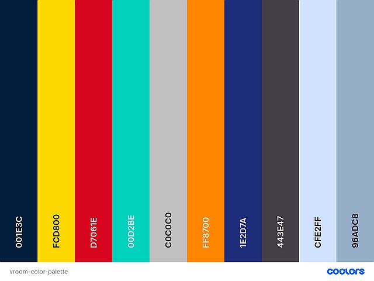
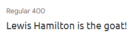
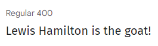
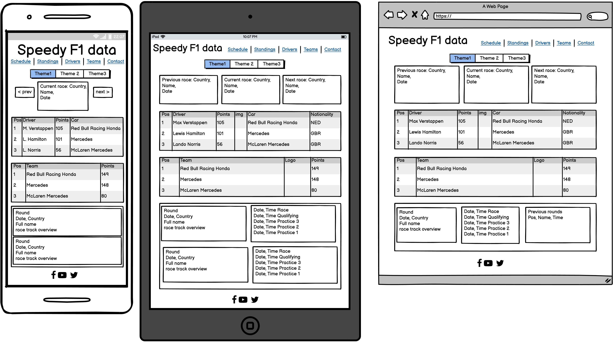
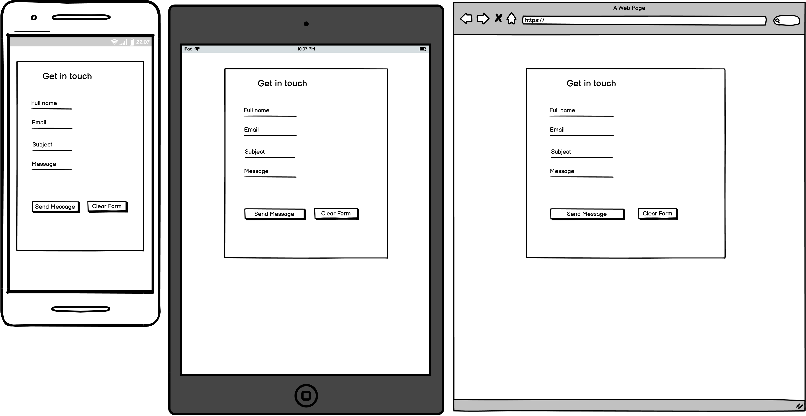

# **Vroom**

## **About**

Link to live project: [Vroom](https://ryagg.github.io/vroom)

Vroom is a website that provides a quick overview of the most important F1 Data using the API-FORMULA-1 by API-SPORTS. Users can see the current, previous, and upcoming race at a glance, take a look at the driver’s and team standings, see the full race calendar with track details and change the website’s theme.

Due to most of the data on the site being dependent on API calls I couldn't use the usual tools (http://ami.responsivedesign.is/ or https://techsini.com/multi-mockup/). The table with the driver standings would have been empty and the three cards for the schedule overview would have showed placeholder text. I therefore used Sizzy to create the mockup.

## **User Experience (UX)**

---

### **User stories:**

**Generic user (website visitor):**

-   As a user, I want to quickly see the time and date of the current and/or next race so that I don’t miss events.
-   As a user, I want to see the driver’s and teams’ standings so that I’m up to date on results.
-   As a user, I want to see the latest results of drivers and teams so that I can gauge their form.
-   As a user, I want to see the whole race calendar with track details so that I can decide if I want to buy tickets for the race.
-   As a user, I want to be able to change the website’s theme so that I can adjust it to my liking.

** Returning user:**

-   As a returning user, I want the website to remember my choice for the website's theme.

**Website owner:**

-   As the website owner, I want the site to be responsive, so that users can enjoy it on all devices from mobile phones to desktops.
-   As the website owner, I want the site to be as informative as possible without being cluttered, so that users can find the information they’re looking for quickly.
-   As the website owner, I want the site to make API calls when necessary and not on every page reload.

## **Design**

---

The project uses the Bootstrap framework to ensure a responsive design. Where possible, design elements with either an association with speed or Formula One were chosen.

### **Colour Scheme**

For the themes I used the team colours from Red Bull Racing, Mercedes-AMG Petronas and McLaren Racing. For the default theme I chose colours with a high contrast to ensure readability and accessibility. I used [Coolors](https://coolors.co) to generate my colour palette. Note: due to limitations regarding the number of colors, black as well as the lighter variants of silver, yellow and orange for the text-shadows are not included.

### **Typography**

For fonts, I used Ubuntu for headings. Especially the letters f, t and n transport a sense of speed. For all other text, I chose Fira Sans.

### **Icons**

There are no icons used on the site itself. The favicon was generated from an
[Font Awesome](https://fontawesome.com) icon.

### **Imagery**

The driver, team logo and racetrack images are being provided by the API. Credit for the images used on the contact and 404 pages as well as for placeholder images is given below in the media section.

### **Wireframes**

I used Balsamiq to plan the site’s layout for different viewports (mobile, tablet and desktop). To better demonstrate the differences, I sort my wireframes by page and show the versions for mobile, tablet and desktop next to each other.

[Wireframes for index.html](assets/wireframes/homepage.png)

Differences in the deployed version:

-   The name of the project has been changed to Vroom.
-   In the navbar, 'Schedule' has been renamed to 'Schedule overview' to better differentiate it from the added 'Full Schedule'.
-   The links for 'Drivers' and 'Teams' have been removed. The additional information has been placed into modals.
-   The elements with the full schedule and information about each race in the 2021 season have been moved to a separate page. The layout hasn't changed, therefore I didn't create a new wireframe.
-   The display of the first three places from the previous year for each race has been removed from the project. It would have added at least 22 more API calls. Furthermore, neither one of the two APIs I'm using provides suitable endpoints.

[Wireframes for contact.html](assets/wireframes/contact.png)

Differences in the deployed version: none.

No wireframe has been created for the 404 page due to it's minimalist design. I decided against creating one ex post as that would defy the purpose of a wireframe.

## **Features**

---

### **Existing Features**

**Add list**

### **Features to be implemented**

**Add list**

## **Technologies Used**

### **Languages**

-   [HTML5](https://developer.mozilla.org/en-US/docs/Web/Guide/HTML/HTML5)
-   [CSS3](https://developer.mozilla.org/en-US/docs/Web/CSS)
-   [JavaScript](https://developer.mozilla.org/en-US/docs/Web/JavaScript)

### **Libraries & Frameworks**

-   [Bootstrap 5.0.1](https://getbootstrap.com/docs/5.0/getting-started/introduction/)
-   [jQuery 3.6.0](https://jquery.com/)
-   [Day.js 1.10.6](https://day.js.org/en/)
-   [Google Fonts](https://fonts.google.com/)
-   [Font Awesome](https://fontawesome.com/)

### **Tools**

-   [VSCode](https://code.visualstudio.com/)
-   [Git BASH](https://gitforwindows.org/)
-   [GitHub](https://github.com/)
-   [Google Chrome Developer Tools](https://developer.chrome.com/docs/devtools/)
-   [Sizzy](https://sizzy.co/)
-   [Balsamiq](https://balsamiq.com/)
-   [Coolors colour palette generator](https://coolors.co/)
-   [Google Cloud Platform](https://cloud.google.com/)
-   [W3C HTML Validation Service](https://validator.w3.org/)
-   [W3C CSS Validation Service](https://jigsaw.w3.org/css-validator/)
-   [GitHub Wiki TOC generator](https://ecotrust-canada.github.io/markdown-toc/)

## **Testing**

---

### **Functionality Testing**

**to be added**

## **Usability Testing**

**to be added**

## **Compatibility Testing**

**to be added**

## **Testing User Stories**

### **User Requirements and Expectations**

The following user requirements and expectations were developed based on the user stories.

#### Expectation: being able to quickly see the date and time of the current and next race

-   Requirement: on the homepage this should be among the first data the users sees.
-   Implementation: the schedule overview has been placed directly beneath the welcome message. From the Full Schedule and Contact page the user can reach the schedule overview via the navbar and from the 404 page the user can use provided link back to the homepage. See the screenshots [here](assets/images/usertests/user-expectation-1.png) and [here](assets/images/usertests/user-expectation-1-example-2.png).

#### Expectation: being able to see the driver's and team's standings

-   Requirement: the user should intuitively find the desired information.
-   Implementation: the tables containing the driver and team standings have been placed on the homepage. Furthermore, the navbar allows quick navigation to each of the tables. See the screenshots [here](assets/images/usertests/user-expectation-2.png), [here](assets/images/usertests/user-expectation-2-example-2.png) and [here](assets/images/usertests/user-expectation-2-example-3.png).

#### Expectation: being able to see the latest results of drivers and teams to be able to gauge their form

Unfortunately, this feature could not be implemented. Neither of the used APIs offers a suitable endpoint to obtain the required data and it was outside the scope of this project to find and implement a custom-made solution.

#### Expectation: being able to see the whole race calendar with track details

-   Requirement: in addition to the schedule overview on the homepage, the user should be able to see the race calendar for the full season with additional information.
-   Implementation: the full schedule page provides the following data for all confirmed races of the 2021 season: the number of the round, the date, country + name of the race, the name of the track and the starting times for the individual race sessions. See the screenshot [here](assets/images/usertests/user-expectation-4.png). Due to the already high number of API calls being made, it was again outside the scope of this project to add another API, e.g. Google Maps, to provide the user with even more data.

#### Expectation: being able to change the website's theme

-   Requirement: the user should be able to intuitively change the website's theme
-   Implementation: on the homepage 4 buttons have been placed that allow the user to select a theme that uses the team colors from Mercedes, Red Bull or McLaren. The button's background and text colors imitate the changes applied by the themes. The fourth button allows the user to revert back to the default theme. The themes change the background and text color of the two tables and add shadow-effects to the table headings. See screenshot (exemplary for one of the themes) [here](assets/images/usertests/user-expectation-5.png). No other elements on the homepage or the other pages are affected on purpose because these elements bear no relation to either drivers or teams.

#### Expectation: the website 'remembers' the user's choice for a theme

-   Requirement: the website applies a previously selected theme after a page reload
-   Implementation: For first time visitors, the theme is set to default. On theme selection, the chosen theme is saved to local storage. On page load a check for a set theme runs and applies the according theme. See code screenshot [here](assets/images/usertests/user-expectation-6.png).

#### Expectation: the website is responsive

-   Requirement: the website can be easily viewed and navigated on different viewports without the content being unreadable or the user having to unnecessarily scroll to see content
-   Implementation: both Bootstrap and a mobile-first approach were used to make the site responsive. Additionally, some content is not displayed on smaller viewports. For reference, please see the mockup and the wireframes.

#### Expectation: the website is informant without being cluttered

-   Requirement: the website offers the most important information about the current F1 season without being cluttered and without feature creep.
-   Implementation: all pages feature a minimalistic design. Text content is kept at the minimum needed to convey the information. Additional information about drivers and teams can be viewed via modals and the user is informed about this in a short text above the corresponding table. See screenshots [here](assets/images/usertests/owner-expectation-2.png) and [here](assets/images/usertests/owner-expectation-2-example-2.png).

#### Expectation: API calls are made when necessary and not on every page reload

-   Requirement: checks should be put into place to ensure that API calls are only being made when necessary
-   Implementation: on first load all API endpoints are called, the data saved to local storage and Boolean variables for each set of data set to true. For later page loads, for each data set a check is run whether the data is in local storage. API calls are only made for missing data. For data that changes regularly (the standings and the schedule overview) additional checks are run to ensure that the data is kept up to date. See code screenshots [here](assets/images/usertests/owner-expectation-3.png) and [here](assets/images/usertests/owner-expectation-3-example-2.png).

## **Bugs**

-   Missing track maps for the Portugese, Saudi Arabia and Abhu Dhabi Grand Prix
    The function addTrackMap(className, query) returns an object with various data about the race track. The variable trackMap contains the URL for the track map. There are URLs for each of the race tracks. But the URLS for the races in Saudi Arabia and Abu Dhabi lead to a '404 Not Found' page. This then causes an uncaught TypeError in the console. Depending on whether I declare the variable trackName or trackMap first the error will read 'Cannot read property 'name' of undefined at addTrackMap' or 'Cannot read property 'image' of undefined at addTrackMap'. This error is neither caused by me nor can it be fixed by me.
    The URL for the race in Portugal displays the race map but on the deployed site only the alt text is displayed. For the moment, I will continue with other features and chores and hopefully be able to find a fix for this before I submit the project.

## **Deployment**

---

-   GitHub Pages

    1. The project was deployed on GitHub Pages. The following steps were taken.
    2. In the repository, go the the project main page.
    3. Click on 'Settings' and then scroll down to the section 'GitHub Pages'.
    4. Click on the link for the new dedicated Page settings tab.
    5. In the new window using the drop-down menu select the main branch and then click on 'Save'.
    6. The site is now published and a link is provided.

-   Forking
    If you wish to use this repository as a starting point or to propose changes to this project, you can fork it. Follow the steps below.

    1. Navigate to the repository, e.g. [Ryagg/ms2-speedy-f1-data](https://github.com/Ryagg/ms2-speedy-f1-data)
    2. Click 'Fork' in the top-right corner.

-   Cloning
    Cloning a repository creates a local copy on your computer. Follow the steps below.
    1. Navigate to the repository, e.g. [Ryagg/ms2-speedy-f1-data](https://github.com/Ryagg/ms2-speedy-f1-data)
    2. Click 'Code' above the list of files.
    3. In the new window, cloning using HTTPS is the default option. Copy the provided link manually or by clicking on the clipboard symbol.
    4. Open Git Bash.
    5. Navigate to your desired directory for the cloned project.
    6. Type 'git clone' followed by the URL copied in step 3.
    7. Press **Enter** to create your local clone.

## **Credits**

**to be added**

### **Media**

The following photos used for this project were obtained from [Unsplash](https://unsplash.com).

#### schedule.html

Nürburgring: Photo by [Jan Ivo Henze](https://unsplash.com/@jan_ivo?utm_source=unsplash&utm_medium=referral&utm_content=creditCopyText) on [Unsplash](https://unsplash.com/s/photos/racetrack?utm_source=unsplash&utm_medium=referral&utm_content=creditCopyText)

#### contact.html

Freeway: Photo by [Jake Givens](https://unsplash.com/@jakegivens?utm_source=unsplash&utm_medium=referral&utm_content=creditCopyText) on [Unsplash](https://unsplash.com/@jakegivens?utm_source=unsplash&utm_medium=referral&utm_content=creditCopyText)

#### 404.html

Red race lights: Photo by [Carlos Quesada](https://unsplash.com/@carlosquesada?utm_source=unsplash&utm_medium=referral&utm_content=creditCopyText) on [Unsplash](https://unsplash.com/collections/895404/formula-one?utm_source=unsplash&utm_medium=referral&utm_content=creditCopyText)

The generic-person icon used as a placeholder in the driver modal was downloaded from [icon-library.com](https://icon-library.com/icon/generic-person-icon-1.html)

The generic-team icon used as a placeholder in the team modal was made by [Freepik](https://www.freepik.com) from [Flaticon](www.flaticon.com)

### **Acknowledgements**

**to be added**
