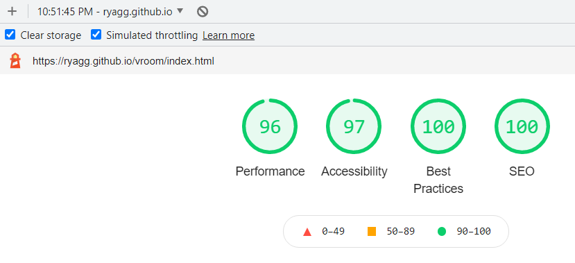
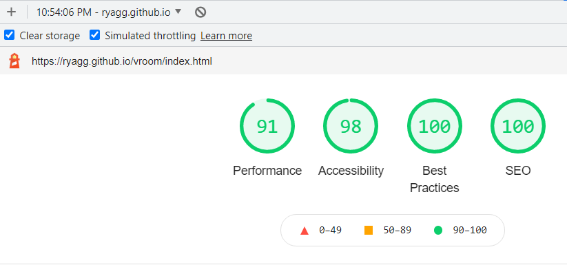
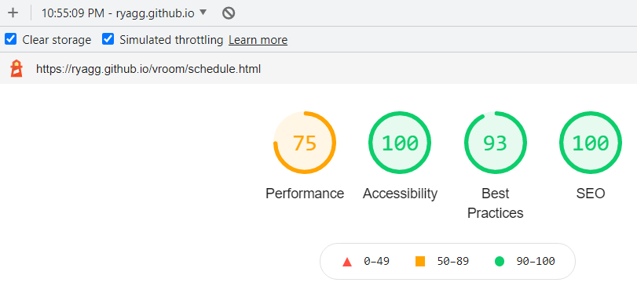
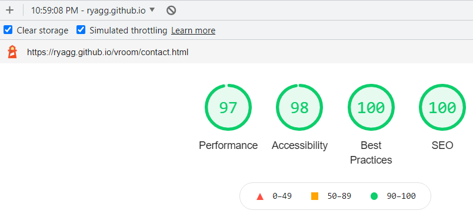
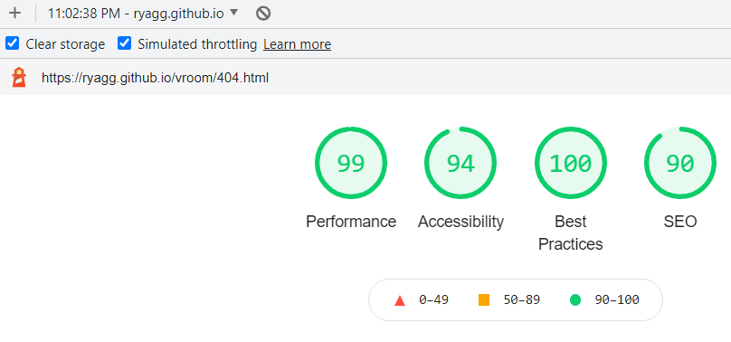

# **Functionality Testing**

## **Navigation bar**

-   Plan

    Make the site easy to navigate by providing a navbar and using easily understandable names for the pages.

-   Implementation

    I used the Bootstrap navbar with a fixed top position. On mobile devices I also used Bootstrap to make the navbar collapse and be displayed within the hamburger sign.

-   Test

    I tested all links on all pages and with different browsers to make sure that the correct site is displayed.

-   Result

    Each site is reachable from every page and on every browser.

-   Verdict

    Working as intended.

## **Schedule overview**

-   Plan

    Let the user find the most important information about the current, next and previous race quickly.

-   Implementation

    The relevant data is being fetched from the API, saved to local storage and then displayed on the page.

-   Test

    Check whether the data is being displayed for first time visitors. Check whether the data is being displayed after page reloads and after clearing the corresponding local storage data.

-   Result

    The data is being displayed in all cases. The data updates correctly in response to date changes if this affects the race schedule.

-   Verdict

    Working as intended.

## **Applying and saving themes**

-   Plan

    Let the user change the site's theme to one of three teams or revert back to the default theme. Let the last selected theme be applied after a page reload.

-   Implementation

    Use JavaScript and jQuery to select page elements, remove and add classes, apply CSS attributes to match the color scheme of the selected team and save the changes as a theme to local storage. Provide users with the option to undo these changes.

-   Test

    Repeatedly switch back and forth both between different team themes and the default theme to check that the changes are correctly applied and undone. Reload the page several times with each theme selected to check that it is active after a page reload.

-   Result

    Themes are correctly applied on selection and changes are correctly removed when changing to another theme. The last selected theme is active after a page reload.

-   Verdict

    Working as intended.

## **Displaying driver and team standings**

-   Plan

    Let the user see the current driver and team standings including points and, in case of drivers and for viewports >= 768px, the driver's team.

-   Implementation

    The relevant data is being fetched from the API, saved to local storage and then displayed on the page.

-   Test

    Check whether the data is being displayed for first time visitors. Check whether the data is being displayed after page reloads and after clearing the corresponding local storage data. Check whether the display of a driver's team is being hidden on mobile devices.

-   Result

    The data is being displayed in all cases. The data updates correctly the day after a race has taken place. Due to the varying starting times for the races and in rare cases of objections to the results, the data is not being updated directly after a race has finished. Even the official F1 site does not update these data for some hours after a race has finished. On mobile devices the column with the team names in the driver standings table is hidden at all times.

-   Verdict

    Working as intended.

## **Displaying modals with additional info about drivers and teams**

-   Plan

    Let the user see additional info about a driver or a team by clicking on the name of the driver or the team.

-   Implementation

    The relevant data is only being fetched from the API when the user clicks on a driver's or a team's name. This is done to prevent even more API calls from being made and to shorten the loading time for the site.

-   Test

    Check whether the correct data is being displayed when the user clicks on a driver's or a team's name in the corresponding table.

-   Result

    The data is being displayed in all cases where the API returns data. For some drivers, the link for the driver's image leads to a 404 page. In these cases the alt-text for the image is being displayed. For other drivers, wrong pictures are being returned by the API. For one team, the name of the director is being displayed as 'null'. Please refer to the bug section for more details about each of these occurences.

-   Verdict

    Working as intended as far as it can be influenced by me. The responses from the API and their database are clearly not working as intended.

## **Displaying the current full schedule with additional information about each race**

-   Plan

    Display information about each race in the season, including the round number, date, country, race and track name, start times for each race session and a track map. Only display races with the status 'confirmed' or 'completed'.

-   Implementation

    The relevant data is being fetched from the F1 Live Motorsport Data API and races with the status 'cancelled' are being removed, the remaining races are being stored in an array. To display the correct track map for each round, another array containing all races has to be searched for the coresponding country name and then the image of the corresponding element being added to the entry. This is due both to the removal of cancelled races and the endpoint returning all racetracks and not only those for the current season. In case of missing data, a short explanation should be displayed. In case of track maps, a generic image of a race track should be displayed.

-   Test

    Check whether the correct data is being displayed for first time visitors and after a page reload.

-   Result

    The data is being displayed correctly in all cases where the API returns all necessary data. For some racetracks, the links for the track maps lead to a 404 page. In two cases, the generic image of a race track and an explanatory text are displayed. In one case the alt-text for the image is being displayed. Please refer to the bug section for more details about each of these occurences.

-   Verdict
    Working as intended in case of all necessary data being available. Working as intended for the races in Saudi Arabia and Abu Dhabi by correctly displaying an explanatory text and the generic race track image. Not working as intended for the Portugese Grand Prix by displaying the alt-text for the image instead of the generic race track.

## **Contact form**

-   Plan

    Give the user the opportunity to submit a message and receive feedback about a successful submission. The user should be able to cancel the process. Inform the site owner about user messages.

-   Implementation

    I used a Bootstrap form and textarea with client-side validation. The user can either submit his/her data or clear the form. A confirmation modal informs the user about a successful submission. EmailJS is used to then send an email with the user's message, name and email address to the site owner. In case of an error, an alert should pop-up and ask the user to either try again later or contact support via (external) email.

-   Test
    I tried to submit without entering any data, without filling out all forms and to clear the form. I did not test the error message because I did not know how to 'provoke' an error.

-   Result
    When clicking 'Submit' without filling out any or all fields or when entering invalid data the user is asked to enter the missing data or to correct his/her input. After the data has been submitted the user is shown a confirmation. The process can be cancelled at all times. The email about the user's message is being sent via EmailJS.com.

-   Verdict
    Working as intended.

## **404 page**

-   Plan

Give the user the opportunity to return to the homepage if he/she entered an invalid URL.

-   Implementation

    Create a '.htaccess' file and a 404 page.

-   Test

Deliberately use wrong subdomain-names and explicitly enter the complete 404 URL.

-   Result

    The 404 page is displayed and the user can use the provided link to return to the main page.

-   Verdict
    Working as intended.

# **W3C Markup Validator**

[W3C Markup Validator](https://validator.w3.org/)

Results: no errors reported for any page. See screenshots [here](assets/images/w3c-results/w3c-markup-homepage.png), [here](assets/images/w3c-results/w3c-markup-schedulepage.png), [here](assets/images/w3c-results/w3c-markup-contactpage.png) and [here](assets/images/w3c-results/w3c-markup-404page.png).

# **W3CSS Validator**

[W3C CSS Validator](https://jigsaw.w3.org/css-validator/)

Results: When using 'validate by direct input' no errors are found. Several warnings are displayed due to the usage of vendor prefixes.
When using 'validate by URI' 13 errors and 409 warnings are found, which are caused by the Bootstrap CSS-file and vendor prefixes.

# **Lighthouse**

[homepage-mobile](assets/images/lighthouse-results/homepage-mobile.png)

[homepage-desktop](assets/images/lighthouse-results/homepage-desktop.png)

[schedule-mobile](assets/images/lighthouse-results/schedule-mobile.png)

[contact-mobile](assets/images/lighthouse-results/contact-mobile.png)

[404-mobile](assets/images/lighthouse-results/404-mobile.png)

[404-desktop](assets/images/lighthouse-results/404-desktop.png)

Overall, these results are quite satisfactory. The bad performances on mobile devices for the schedule page results, among other things, from the API returning links to images in one size regardless of the target device and lies outside my control.

# **Usability Testing**

Family, friends and colleagues were asked to test the site on their computers and/or mobile devices and their preferred browsers. No issues regarding the navigation of the site were reported. When using Firefox, for the homepage the site takes way too long to load and seems to constantly reload before finally displaying the page content. 'TypeError: Network error when attempting to fetch resource' is repeatedly being displayed in the console. The others pages are being loaded and displayed normally. No problems could be noticed or have been reported when using Chrome, Edge or Opera. No issues regarding the buttons, modals or contact form were reported.

# **Compatibility Testing**

Both [Google Chrome Developer Tools](https://developer.chrome.com/docs/devtools/) and [Sizzy](https://sizzy.co/) were used throughout the development process to test responsiveness. Especially Sizzy allowed me to view different viewport sizes simultaneously to spot unwanted visuals at a glance. The following devices and viewports were tested:

-   iPhone 5 (320 x 568px)
-   iPhone 8 (375 x 667px)
-   Galaxy Note 10 (412 x 869px)
-   iPad Pro 11 (834 x 1194px)
-   Laptop S (1280 x 800)
-   MacBook Air (1440 x 900px)
-   Desktop (1920 x 1080px)
-   iMac Retina 27 (2560 x 1440px)

No issues regarding the responsiveness have been noticed. Feedback regarding the size of the image on the 404 page and the need for users to scroll down on some devices to see the link to the homepage has been noticed and the image size has been decreased.
